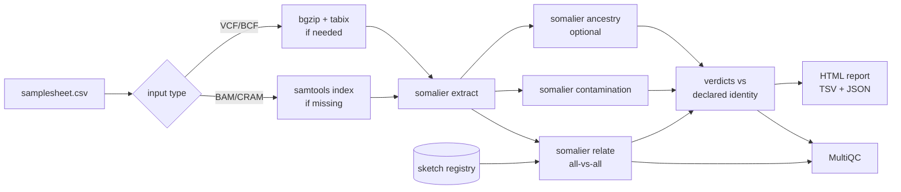

# Biocentric/concordance-nf

[](https://github.com/Biocentric/concordance-nf/actions/workflows/ci.yml)
[](https://www.nextflow.io/)
[](https://www.docker.com/)
[](https://sylabs.io/docs/)
[](https://docs.conda.io/en/latest/)
[](https://github.com/nf-core/modules)
[](https://github.com/brentp/somalier)

## Introduction

**Biocentric/concordance-nf** is a bioinformatics pipeline for SNP concordance
and sample-identity QC on WGS, WES and targeted sequencing data. It answers one
question for every pair of samples: **are these the same individual, and is that
what you expected?**

It takes a samplesheet of BAM/CRAM/VCF files that declares which samples are
supposed to belong to which individual, extracts a compact genotype sketch from
each, compares every sample against every other, and reports the pairs that
disagree with the declared structure — sample swaps, unexpected duplicates,
unexpected relatedness — alongside per-sample depth, sex and contamination
checks.

> [!NOTE]
> This pipeline follows nf-core conventions and is built from
> [nf-core/modules](https://github.com/nf-core/modules), but it is not an
> official nf-core pipeline.

1. Validate the samplesheet and classify each input ([`splitCsv`](https://www.nextflow.io/docs/latest/operator.html#splitcsv))
2. Index alignments that arrive without one ([`samtools index`](https://www.htslib.org/doc/samtools-index.html)), compress and index VCFs that need it ([`bgzip`/`tabix`](https://www.htslib.org/doc/tabix.html))
3. Extract a genotype sketch per sample ([`somalier extract`](https://github.com/brentp/somalier))
4. Optionally mix in archived sketches from a persistent registry
5. All-vs-all relatedness, IBS0 and sex inference ([`somalier relate`](https://github.com/brentp/somalier))
6. CHARR and pairwise contamination ([`somalier contamination`](https://github.com/brentp/somalier/blob/master/cancer-concordance-contamination.md))
7. Optional ancestry prediction ([`somalier ancestry`](https://github.com/brentp/somalier))
8. Judge every pair against the samplesheet and emit verdicts, an HTML report and a JSON summary
9. Aggregate QC ([`MultiQC`](http://multiqc.info/))



## Quick start

> [!NOTE]
> If you are new to Nextflow and nf-core, please refer to [this page](https://nf-co.re/docs/usage/installation)
> on how to set up Nextflow. Make sure to [test your setup](https://nf-co.re/docs/usage/introduction#how-to-run-a-pipeline)
> with `-profile test` before running the workflow on actual data.

Run the bundled test — a real run, no stubbing, finishes in under a minute:

```bash
nextflow run Biocentric/concordance-nf -profile test,docker --outdir results-test
```

It ships a synthetic 7-sample cohort with a deliberately broken identity
structure, and should find exactly two failures:

```
[concordance] FAIL s_c <-> s_e : UNEXPECTED_DUPLICATE (relatedness 1.000, IBS0 rate 0.0000)
[concordance] FAIL s_f <-> s_g : SAMPLE_SWAP (relatedness -0.010, IBS0 rate 0.1258)
```

Then open `results-test/concordance/concordance_report.html`.

Swap `docker` for `singularity`, `apptainer` or `conda` as your site requires.

## Usage

First, prepare a samplesheet:

**samplesheet.csv**

```csv
sample,subject,family,alignment,index,sex,batch
WGS_2024_0117,PATIENT01,FAM01,/data/PATIENT01_wgs.cram,/data/PATIENT01_wgs.cram.crai,female,plate3
WES_2024_0193,PATIENT01,FAM01,/data/PATIENT01_wes.bam,,female,plate1
WGS_2024_0118,PATIENT02,FAM01,/data/PATIENT02_wgs.cram,,male,plate3
WGS_2024_0119,PATIENT03,FAM03,/data/PATIENT03_wgs.cram,,male,plate3
```

| Column | Required | Meaning |
| --- | --- | --- |
| `sample` | yes | Unique library or run identifier |
| `subject` | yes | **The expectation being tested.** Rows sharing a subject must come back genotypically identical; rows with different subjects must not |
| `alignment` | yes | BAM, CRAM, SAM, VCF, BCF or GVCF |
| `index` | no | Generated on the fly when omitted (required for BCF) |
| `family` | no | Relatedness between different subjects in one family is expected rather than flagged. Two subjects in a family coming back *identical* is still a failure |
| `sex` | no | Checked against the sex somalier infers from X heterozygosity and Y depth |
| `batch` | no | Free-text grouping label, carried into the report |

Use the sample id itself as `subject` when every row is a distinct individual.
Full spec: [`assets/samplesheet_schema.json`](assets/samplesheet_schema.json).

Now run the pipeline:

```bash
nextflow run Biocentric/concordance-nf \
   -profile <docker/singularity/apptainer/conda> \
   --input samplesheet.csv \
   --fasta /ref/GRCh38.fa \
   --genome GRCh38 \
   --outdir <OUTDIR>
```

Compare against archived sketches as well as the current batch — the mode this
pipeline is really for:

```bash
nextflow run Biocentric/concordance-nf \
   -profile docker \
   --input new_batch.csv \
   --fasta /ref/GRCh38.fa \
   --registry /archive/somalier-sketches \
   --outdir <OUTDIR>
```

Gate a downstream process on the result with `--fail_on_discordance`, which
exits non-zero when any verdict is `fail`.

> [!WARNING]
> Please provide pipeline parameters via the CLI or Nextflow `-params-file`
> option. Custom config files including those provided by the `-c` Nextflow
> option can be used to provide any configuration _**except for parameters**_.

`--help` lists every parameter. See [`docs/usage.md`](docs/usage.md) for
threshold tuning by depth and assay type, and for the contig-naming trap
(`chr1` vs `1`) that silently yields zero usable sites.

## Verdicts

| Verdict | Meaning | Severity |
| --- | --- | --- |
| `CONFIRMED_MATCH` | Same subject declared, genotypes identical | pass |
| `CONFIRMED_DISTINCT` | Different subjects declared, genotypes unrelated | pass |
| `CONFIRMED_RELATED` | Same family, relatedness detected as expected | pass |
| `SAMPLE_SWAP` | Same subject declared, genotypes disagree | **fail** |
| `UNEXPECTED_DUPLICATE` | Different subjects declared, genotypes identical | **fail** |
| `UNEXPECTED_RELATEDNESS` | Unrelated declared, relatedness detected | warn |
| `MISSING_RELATEDNESS` | Same family declared, no relatedness found | warn |
| `REGISTRY_MATCH` | Matches an archived sketch not in this samplesheet | warn |
| `INCONCLUSIVE` | Too few usable sites to decide | warn |

A pair is called identical when **relatedness ≥ 0.85 _and_ the IBS0 rate ≤ 0.005**.

Both halves matter. IBS0 counts sites where one sample is hom-ref and the other
hom-alt — genetically impossible within one individual — so it separates self
(relatedness ~1, IBS0 ~0) from parent–child (~0.5, IBS0 ~0) and from full sibs
(~0.5, IBS0 > 0). It is also the statistic that survives tumour LOH, where loss
of heterozygosity depresses het-based concordance for a genuine same-patient
pair but cannot manufacture a hom-ref/hom-alt transition.

Raw genotype concordance percentage is deliberately _not_ the decision
statistic: it is uncalibrated and both MAF- and depth-dependent, so a threshold
tuned on one panel or coverage regime does not transfer. It is reported for
reference only.

## The sketch registry

`somalier extract` writes a ~200 KB sketch per sample that is permanent and
cheap to re-compare. Publish them to a directory and pass it as `--registry`,
and every run compares new samples against your entire history rather than only
against their own batch — which is usually where the swap actually is.

```bash
cp results/sketches/*.somalier /archive/somalier-sketches/
```

Sketches are comparable across genome builds (somalier ≥ 0.2.16), so a registry
can mix GRCh37, GRCh38 and CHM13 extractions. The exception is the
`GRCh38_rna` site set, which uses different coordinates.

> [!IMPORTANT]
> A sketch carries ~17k genotypes and is fully identifying. Treat the registry
> as personal data, not as QC metrics.

## Why this pipeline exists

nf-core ships somalier *modules* but no pipeline that uses them, and its only
somalier subworkflow (`vcf_extract_relate_somalier`) takes VCFs and requires a
PED. This adds the parts that were missing for identity QC:

| Gap | What this adds |
| --- | --- |
| No alignment-input subworkflow | `BAM_CRAM_EXTRACT_SOMALIER`, with on-the-fly indexing |
| nf-core modules pin somalier **0.2.19** | Pinned to **0.3.5** (see below) |
| No module for `somalier contamination` | `SOMALIER_CONTAMINATION` local module |
| Nothing carries *expected* identity | `subject`/`family` samplesheet columns, checked per pair |
| Output is raw relatedness numbers | Verdicts, HTML report, JSON summary, MultiQC sections |
| Comparisons scoped to one batch | `--registry` |

### The version pin

The nf-core somalier modules pin **0.2.19**, which predates the entire 0.3.x
line. This pipeline overrides the container to **0.3.5** in
[`conf/modules.config`](conf/modules.config):

- **0.3.2** — CHARR contamination in `relate`; the `contamination` subcommand
  for Conpair-style pairwise attribution; `AB_plot`. Also renames
  `homozygous_concordance` to `concordance`, so output parsers break across the
  boundary (this pipeline handles both).
- **0.3.4** — fixes a long-standing allele-counting bug **for long reads**. On
  ONT/PacBio, 0.2.19 is actively wrong.
- **0.3.5** — fixes incorrect hom-ref/hom-alt counts when `--sites` is passed to
  `relate`.

Override with `--somalier_container` / `--somalier_singularity`.

## Pipeline output

`concordance/` holds the report and verdict tables, `somalier/` the raw somalier
output, `sketches/` the per-sample sketches to archive, `multiqc/` the
aggregated QC. See [`docs/output.md`](docs/output.md) for the column-by-column
spec and a guide to interpreting each failure mode.

## Tests

| Command | What it covers | Needs |
| --- | --- | --- |
| `python3 tests/test_report.py` | Verdict engine: every verdict path, plus sex, depth, site-count and contamination checks | nothing |
| `nextflow run . -profile test,docker` | Full pipeline on real data, real somalier | Docker |
| `bash tests/run_e2e.sh` | The above, plus asserts every verdict against known ground truth | Docker |
| `nextflow run . -profile test_stub,docker -stub` | Mixed BAM/CRAM/VCF wiring, including on-the-fly indexing | Docker |

Regenerate the committed fixture with
`python3 tests/make_fixture_vcfs.py assets/test_data`.

## Credits

Biocentric/concordance-nf was written by Biocentric.

All relatedness, IBS0, sex and contamination estimation is the work of
[somalier](https://github.com/brentp/somalier) by Brent Pedersen and Aaron
Quinlan. This pipeline contributes wiring, the expectation model and reporting.

Released under the [MIT licence](LICENSE), as are somalier and nf-core/modules.

## Contributions and Support

Contributions are welcome — please open an issue or pull request.

## Citations

If you use this pipeline, please cite somalier:

> Pedersen BS, Bhetariya PJ, Brown J, Kravitz SN, Marth G, Jensen RL, Bronner MP,
> Underhill HR, Quinlan AR. **Somalier: rapid relatedness estimation for cancer
> and germline studies using efficient genome sketches.** *Genome Medicine* 12,
> 62 (2020). doi: [10.1186/s13073-020-00761-2](https://doi.org/10.1186/s13073-020-00761-2)

Tool-by-tool references are in [`CITATIONS.md`](CITATIONS.md).

This pipeline uses code and infrastructure developed by the nf-core community,
reused here under the MIT licence:

> **The nf-core framework for community-curated bioinformatics pipelines.**
> Philip Ewels, Alexander Peltzer, Sven Fillinger, Harshil Patel, Johannes Alneberg,
> Andreas Wilm, Maxime Ulysse Garcia, Paolo Di Tommaso & Sven Nahnsen.
> *Nature Biotechnology* (2020). doi: [10.1038/s41587-020-0439-x](https://doi.org/10.1038/s41587-020-0439-x)
